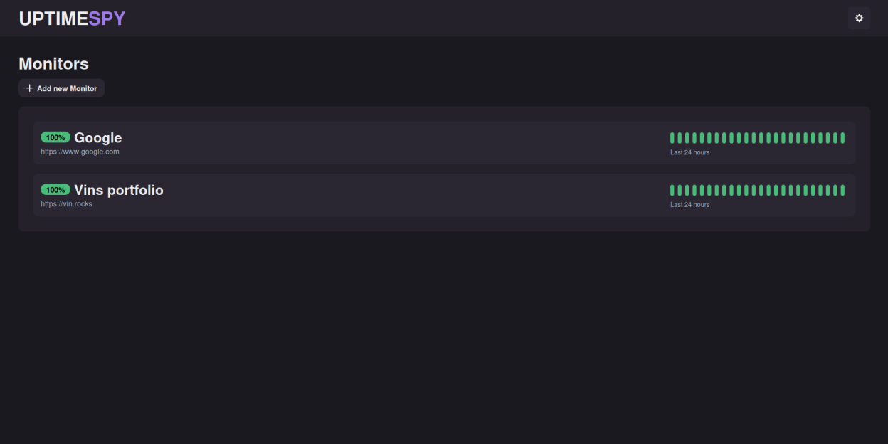
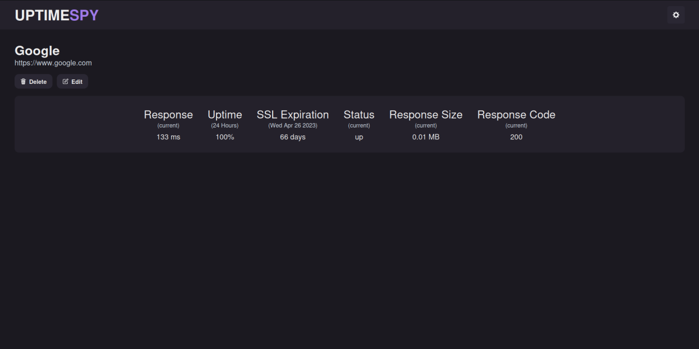

# UPTIMESPY 🔍
# What is UPTIMESPY?


UPTIMESPY is a fast, lightweight and easy to use website monitoring tool made by a solo developer called [Vin H](https://vin.rocks).

## ✨ Features
- 24/7 Monitoring
- Fast outage detection
- 24 hour outage logs
- See responsetime, uptime, ssl expiration, status, response size and response code

# 📖 How to use
This guide shows you how to use UPTIMESPY!

## 🔧 Lets go!
```bash
git install https://github.com/vin-ll/uptimespy.git

cd uptimespy
```

You successfully installed uptimespy. Lets install the node dependencies!

```bash
npm install
npm install -g pm2
```

Wow that was easy! (Not fast :P)

Now we want to run everything
```bash
pm2 start npm -- run server --name UPTIMESPY_BACKEND
pm2 start npm -- run checker  --name UPTIMESPY_CHECKER
pm2 start npm -- run frontend --name UPTIMESPY_FRONTEND 
```

pm2 makes everything run in the background so we dont have to run it everytime we use it :P.

NOTE: THIS MAKES THE FRONTEND RUN IN DEVELOPMENT MODE IF YOU WANT TO RUN IT IN PRODUCTION MODE (way more stable) RUN NPM RUN BUILD AND SETUP NGINX WITH IT (development is totally fine though)

# 🦮 Contributing
The main purpose of this repository is to continue evolving UPTIMESPY, making it faster, more stable and more efficient. If you wish to contribute just add your changes/fixes and I will review them once you make a pull request. (Shouldnt take longer than 2 days)

# 👨 Creator
The creator of this application is Vin H and his website is: https://vin.rocks